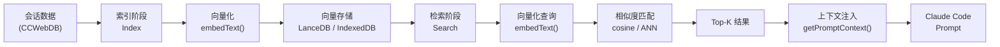
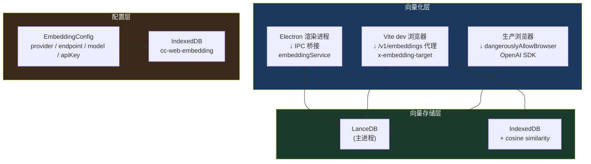
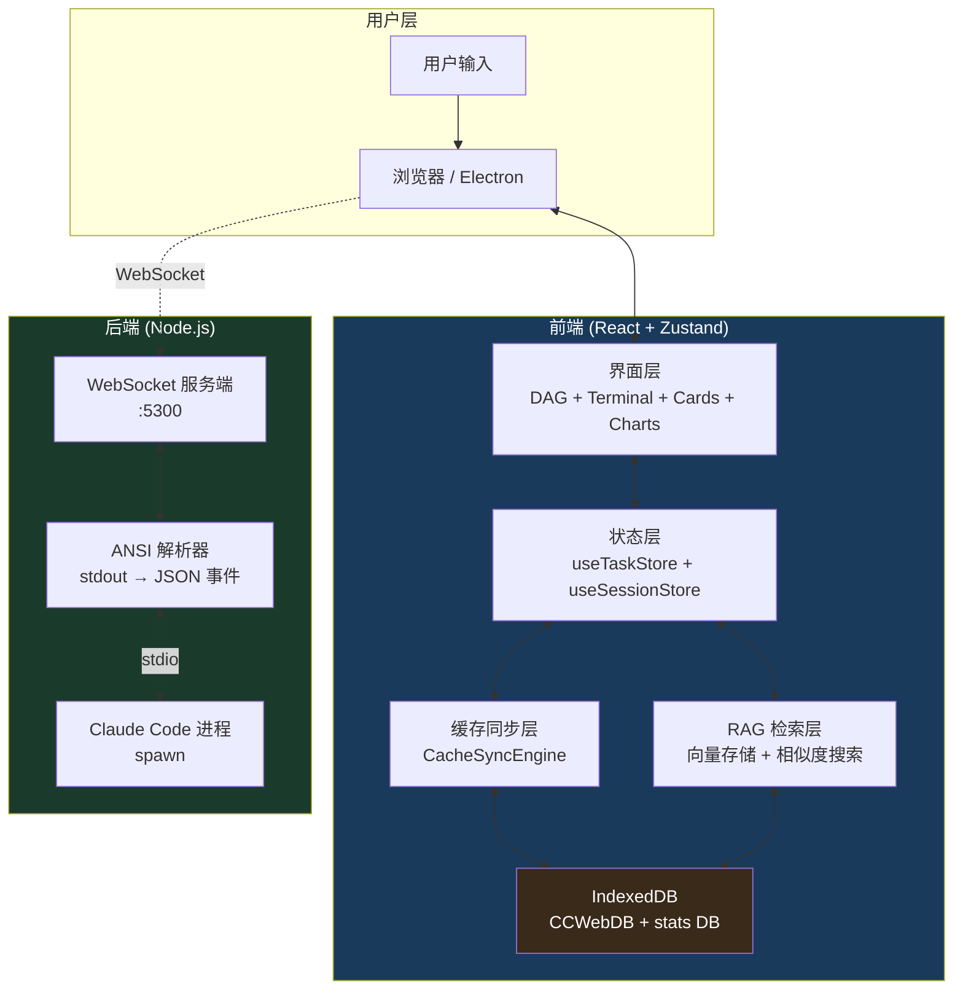
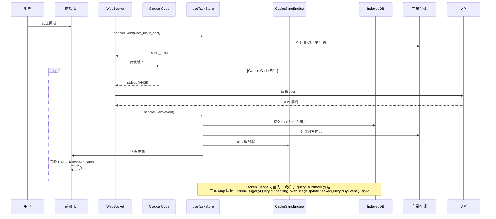
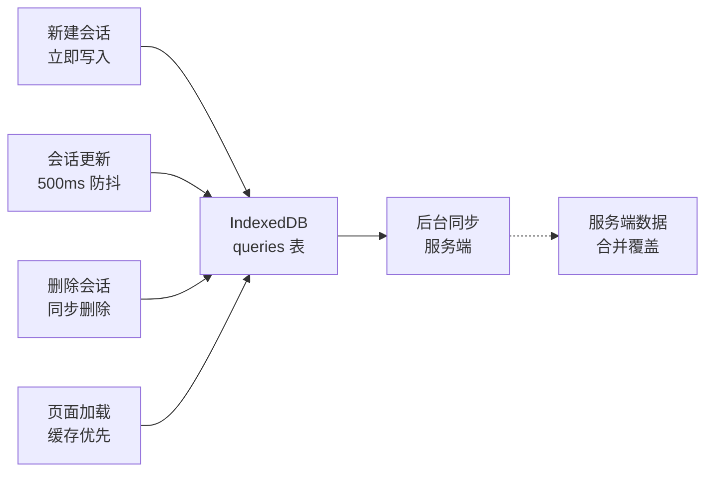
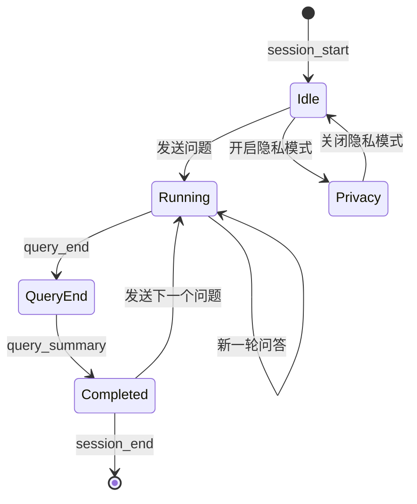

# Claude Code DAG Web UI

<p align="center">
  
</p>

<p align="center">

[](https://opensource.org/licenses/MIT)
[](https://www.typescriptlang.org/)
[](https://react.dev/)
[](https://www.electronjs.org/)
[](https://nodejs.org/)

</p>

---

## 这个项目做什么？

将 Claude Code 的 Agent 执行过程以 **DAG（有向无环图）** 的形式实时可视化，让你直观看到 AI 在思考什么、调用了什么工具、输出了什么结果——而不是面对一片滚动的终端日志。

---

## 适合哪些人？

| 群体 | 为什么需要它 |
|------|-------------|
| **Claude Code 重度用户** | 可视化理解 AI 的执行链路，不再靠猜 |
| **AI Agent 开发者** | 调试 Agent 行为，分析工具调用链路 |
| **学习 AI 编程的开发者** | 可视化理解 AI 如何分解任务、调用工具 |
| **数据分析师** | 分析 Token 消耗趋势，优化 Prompt 成本 |

---

## 功能列表

### 执行可视化

| 功能 | 说明 |
|------|------|
| **DAG 执行图** | 实时展示 Agent 思维链路，支持折叠/展开节点 |
| **DAG 节点分组** | 按工具类型或会话自动分组，结构更清晰 |
| **终端视图** | 原始工具日志实时输出，无需 Tab 切换 |
| **工具卡片** | 每个工具调用的参数、结果、耗时独立展示 |
| **Markdown 渲染** | GFM 完整支持：表格、代码块、Mermaid 图表等 |
| **流式总结** | AI 回答逐字输出，卡片带打字机动画 |

### 会话管理

| 功能 | 说明 |
|------|------|
| **多会话管理** | 创建/切换/删除会话，随时切换工作上下文 |
| **FIFO 自动淘汰** | 会话超过 100 条时自动删除最旧的 |
| **隐私模式** | 完全离线，所有数据仅存在本地 localStorage |
| **会话搜索** | 全局搜索历史会话和问答内容 |
| **历史召回** | 基于访问频率的智能会话推荐 |

### 数据分析

| 功能 | 说明 |
|------|------|
| **Token 趋势统计** | 折线图展示输入/输出 Token 消耗趋势 |
| **模型定价表** | 按模型估算本次会话成本 |
| **执行分析面板** | 工具分布饼图、错误率趋势图、耗时分析 |
| **工具排行榜** | Top-N 最常用工具排名 |
| **按工作路径过滤** | 各统计面板支持按 `workspacePath` 隔离数据 |

### RAG 智能检索

| 功能 | 说明 |
|------|------|
| **向量相似度检索** | 基于 Embedding 的语义搜索，检索相似历史问答 |
| **多后端支持** | OpenAI / Ollama / Cohere 自定义配置 |
| **Answer 分块** | 按 Markdown 段落自动分块（100-1000 字符），检索更精准 |
| **混合检索** | 支持 `query` / `toolcall` / `hybrid` 三种检索类型 |
| **历史批量索引** | 一键将历史会话导入向量数据库 |
| **工作路径隔离** | 按项目目录分别管理索引，避免跨项目污染 |
| **上下文注入** | 检索结果直接注入到 Claude Code prompt |
| **抽屉/弹窗双模式** | `Cmd+Shift+R` 快捷键切换 |

### 存储与同步

| 功能 | 说明 |
|------|------|
| **IndexedDB 持久化** | 所有会话、问答、Token 统计本地存储 |
| **防抖写入** | 会话更新 500ms 防抖写入，减少 IndexedDB 压力 |
| **缓存优先加载** | 页面启动从本地缓存读取，后台同步服务端 |
| **自动压缩** | 长文本自动压缩，长会话自动分片 |
| **存储监控** | 实时监控 IndexedDB 使用量，接近容量时告警 |

### 界面体验

| 功能 | 说明 |
|------|------|
| **暗黑/明亮模式** | CSS 变量驱动，主题切换无闪烁 |
| **响应式布局** | 自适应窗口宽度 |
| **快捷键支持** | `Cmd+K` 搜索、`Cmd+\` 折叠、`Cmd+Shift+R` RAG |
| **连接状态指示** | WebSocket 连接状态实时显示 |
| **错误边界** | 组件崩溃自动降级，不影响整体使用 |
| **加载骨架屏** | 数据加载中显示骨架占位 |
| **多语言支持** | 中文优先界面 |

---

## 效果预览

<details open>
<summary><strong>DAG 执行图（暗黑模式）</strong></summary>

</details>

<details>
<summary><strong>终端卡片视图（暗黑模式）</strong></summary>

</details>

<details>
<summary><strong>明亮模式</strong></summary>

</details>

---

## 环境要求

- **Node.js** ≥ 20（推荐 22）
- **Claude Code CLI** 已安装

```bash
npm install -g @anthropic/claude-code
claude --version  # 验证安装
```

---

## 使用方式一：开发模式

```bash
# 克隆项目
git clone https://github.com/ogj130/claude-code-dag-web-ui.git
cd claude-code-dag-web-ui

# 安装依赖
npm install

# 启动（前端 + 后端同时运行）
npm run dev
```

浏览器打开 **http://localhost:5400**

---

## 使用方式二：安装桌面应用

👉 **[下载最新版本](https://github.com/ogj130/claude-code-dag-web-ui/releases/latest)**

### macOS

1. 下载 `.dmg` 镜像（Apple Silicon 选 arm64，Intel 选 x64）
2. 打开 DMG，拖入「应用程序」
3. 首次运行需在「系统设置 → 隐私与安全性」允许

### Windows

下载 `.exe` 安装包，双击运行即可。

### Linux

```bash
# AppImage（推荐）
chmod +x Claude-Code-Web-UI-*.AppImage
./Claude-Code-Web-UI-*.AppImage

# 或 deb
sudo dpkg -i claude-code-web-ui_*.deb
```

---

## 界面说明

```
┌──────────────────────────────────────────────────────────────┐
│  Toolbar：会话列表 / 主题切换 / Token 统计 / RAG / 隐私设置    │
├──────────────────────────┬───────────────────────────────────┤
│                          │                                    │
│   DAG 可视化区域           │   终端视图区域                      │
│   实时展示 Agent 执行链路   │   原始工具日志 + 输入框              │
│   可折叠/展开查询节点       │                                    │
│                          │                                    │
├──────────────────────────┴───────────────────────────────────┤
│  Bottom Bar：最近工具调用 / Token 消耗 / RAG 上下文条数        │
└──────────────────────────────────────────────────────────────┘
```

### DAG 节点类型

| 节点 | 含义 | 颜色 |
|------|------|------|
| **Agent** | 根节点，Claude Agent 本身 | 蓝 |
| **Query** | 用户提问（可折叠） | 绿 |
| **Tool** | 工具调用（Read/Bash/Edit 等） | 黄 |
| **RAG** | 向量检索结果（可折叠） | 橙 |
| **Summary** | 本轮总结，AI 生成的分析 | 紫 |

---

## RAG 智能检索架构

### RAG 完整数据流



### 双后端存储策略

| 环境 | 向量库 | 说明 |
|------|--------|------|
| **Electron 生产** | LanceDB | 高性能 ANN 搜索、磁盘持久化、Rust FFI |
| **Vite dev 浏览器** | IndexedDB + JS | 纯浏览器实现，离线可用，无需额外依赖 |



### 向量化调用链路

```
Electron 渲染进程
    ↓ import embedText() (src/utils/embedding.ts)
    ↓ 检测环境
    ├── Electron → IPC invoke('embedding:compute')
    │               ↓
    │               electron/src/main.ts 主进程
    │               ↓ import embeddingService (src/utils/embeddingService.ts)
    │               ↓ OpenAI SDK 调用
    │
    ├── Vite dev 浏览器 → fetch('/v1/embeddings')
    │                     ↓
    │                     vite.config.ts middleware
    │                     读取 x-embedding-target header
    │                     代理到配置的 API endpoint
    │
    └── 生产构建 → dangerouslyAllowBrowser: true
                   直调 OpenAI API（需配置 CORS）
```

### 向量数据库设计

#### LanceDB 表结构（Electron）

```
表名: rag_global（全局向量表）

字段:
  id          string   主键
  vector      float32[] embedding 向量
  content     string   原始文本
  chunkType   string   'query' | 'toolcall' | 'answer'
  sessionId   string   来源会话 ID
  queryId     string   来源查询 ID
  toolCallId  string?  来源工具调用 ID（仅 toolcall）
  workspacePath string 工作路径
  timestamp   number   索引时间
  metadata    JSON     扩展元数据
```

#### IndexedDB 结构（浏览器开发环境）

```
数据库: cc-web-vector

chunks 表:
  id            auto-increment (主键)
  content       string
  vector        number[]
  chunkType     string
  sessionId     string
  queryId       string
  workspacePath  string
  timestamp     number

索引: chunkType, sessionId, queryId, workspacePath, timestamp
```

### Answer 分块策略

```
原始 Answer 文本（可能很长）
    │
    ▼
1. 按 Markdown 段落分隔（## 标题 或 \n\n 双换行）
    │
    ▼
2. 长段落按句子分隔（中文句号 / 英文句号）
    │
    ▼
约束条件:
  MAX_CHUNK_SIZE = 1000 字符
  MIN_CHUNK_SIZE = 100 字符
  (不足 100 字符的段落合并到前一个)
    │
    ▼
每个 chunk 独立 embedding → 检索更精准
每个 chunk 保留 parentQuery → 追溯原始问题
```

### RAG 配置管理

```
IndexedDB: cc-web-embedding (Dexie.js)

configs 表:
  id              string   主键 (ecfg_{timestamp}_{random})
  name            string   配置名称（如 "OpenAI 3.5"）
  provider        string   'openai' | 'ollama' | 'cohere' | 'local'
  endpoint        string   API 地址（可自定义 OpenAI 兼容接口）
  encryptedApiKey string   AES-GCM 加密存储（仅加密敏感字段）
  model           string   Embedding 模型名
  dimension       number   向量维度（自动检测或手动指定）
  isDefault       number   0 | 1（是否为默认配置）
  createdAt       number
  updatedAt       number

索引: id, name, provider, isDefault, updatedAt
```

### RAG 上下文注入

```
检索结果 (SearchResult[])
    │
    ▼
useRAGContext (Zustand 状态)
    │
    ▼ getPromptContext()
[知识上下文]
以下是与你问题相关的历史对话片段：

[1] 问题: xxx | 来源: 会话标题 | 时间 | 相似度: 85%
[2] 回答: xxx | 来源: 会话标题 | 时间 | 相似度: 72%
[/知识上下文]
    │
    ▼
Claude Code prompt → 生成更精准的回答
```

### RAG 检索参数

| 参数 | 可选值 | 说明 |
|------|--------|------|
| `type` | `query` / `toolcall` / `hybrid` | 检索类型 |
| `topK` | `5` / `10` / `20` / `50` | 返回结果数量 |
| `threshold` | `0.3` / `0.5` / `0.7` / `0.85` | 相似度阈值 |
| `workspacePaths` | `string[]` | 筛选特定工作路径 |

---

## 架构设计

### 系统架构（完整分层）



### 事件驱动数据流



### 缓存同步策略（Phase 2.2）



### 状态转换



### 模块说明

| 模块 | 职责 |
|------|------|
| `src/stores/useTaskStore.ts` | 核心状态管理，事件处理器，DAG 节点状态 |
| `src/stores/useSessionStore.ts` | 会话管理，FIFO 淘汰，隐私模式，缓存同步 |
| `src/stores/cacheSync.ts` | 缓存同步引擎，防抖/立即写入，服务端同步 |
| `src/stores/queryStorage.ts` | Query CRUD，自动压缩，分片存储 |
| `src/stores/db.ts` | stats DB (Dexie)，Token/执行统计持久化 |
| `src/lib/db.ts` | CCWebDB (Dexie)，RAG 内容存储，向量索引 |
| `src/stores/vectorStorage.ts` | 统一向量存储接口（自动分发 LanceDB / IndexedDB） |
| `src/stores/localVectorStorage.ts` | IndexedDB + 余弦相似度实现（浏览器环境） |
| `src/stores/embeddingConfigStorage.ts` | Embedding 配置管理，API Key 加密存储 |
| `src/utils/embedding.ts` | 统一向量化入口，检测运行环境 |
| `src/utils/embeddingService.ts` | OpenAI SDK + 多 Provider 适配 |
| `src/hooks/useRAGContext.ts` | RAG 上下文状态管理，prompt 生成 |
| `src/components/DAG/` | ReactFlow 可视化，节点渲染，布局算法 |
| `src/components/ToolView/` | 终端视图、工具卡片、Markdown 渲染 |
| `src/components/TokenAnalytics.tsx` | Token 趋势折线图、模型定价表 |
| `src/components/ExecutionAnalytics.tsx` | 工具分布、错误率趋势、耗时分析 |
| `src/components/RAGRetrievalPanel.tsx` | RAG 检索面板，向量配置，索引管理 |
| `src/components/RAGRetrievalModal.tsx` | 抽屉/弹窗双模式容器 |
| `src/hooks/useWebSocket.ts` | WebSocket 连接，事件分发 |
| `server/` | WebSocket Server + ANSI Parser + Claude Code 进程管理 |
| `electron/` | Electron 主进程，HTTP 静态服务器，桌面打包 |

### 数据库架构

```
┌─────────────────────────────────────────────────────┐
│                 IndexedDB (Dexie.js)                │
├──────────────────────────┬──────────────────────────┤
│   CCWebDB                │   cc-web-ui (stats DB)   │
│   ───────────            │   ─────────────────────  │
│  sessions                │  sessions (元数据)         │
│  queries (RAG 内容)       │  queries (统计)          │
│                          │  toolCalls               │
│  用于 RAG 检索             │  sessionShards (分片)    │
│  向量化索引               │                          │
│  分片存储                 │  用于 Token/执行分析      │
│                          │  workspacePath 过滤       │
├──────────────────────────┼──────────────────────────┤
│   cc-web-vector           │   cc-web-embedding       │
│   ─────────────────      │   ───────────────────    │
│  chunks (向量+文本)        │  configs (Embedding配置)  │
│                          │  API Key AES-GCM 加密    │
└──────────────────────────┴──────────────────────────┘
```

---

## 数据安全

| 模式 | 数据存储 | 网络同步 |
|------|----------|----------|
| **标准模式** | IndexedDB 本地 + 可选服务端同步 | WebSocket |
| **隐私模式** | 仅 localStorage | 无任何网络请求 |
| **RAG 索引** | API Key 加密存储 (AES-GCM) | 仅发送给配置的 Embedding 后端 |

---

## 技术栈

```
前端                  后端                   Electron
───────────────     ────────────────       ─────────────
 React 18      →    Node.js WS Server      Electron 33
 TypeScript    →    tsx runner             WebSocket
 Zustand       →    Claude Code spawn     HTTP Server
 ReactFlow     →    ANSI Parser           electron-builder
 xterm.js      →                          (跨平台打包)
 react-markdown→
 Dexie.js      →
 LanceDB       →
 OpenAI SDK    →
```

---

## 本地构建

```bash
# 克隆后
npm install

# 前端构建
npm run build

# Electron 桌面应用构建
cd electron
npm install
ELECTRON_MIRROR="https://npmmirror.com/mirrors/electron/" npm run dist

# 输出目录
electron/release/
├── *.dmg      # macOS
├── *.exe      # Windows
├── *.AppImage # Linux
├── *.deb
└── *.rpm
```

---

## License

MIT · Made with by [ogj130](https://github.com/ogj130)
