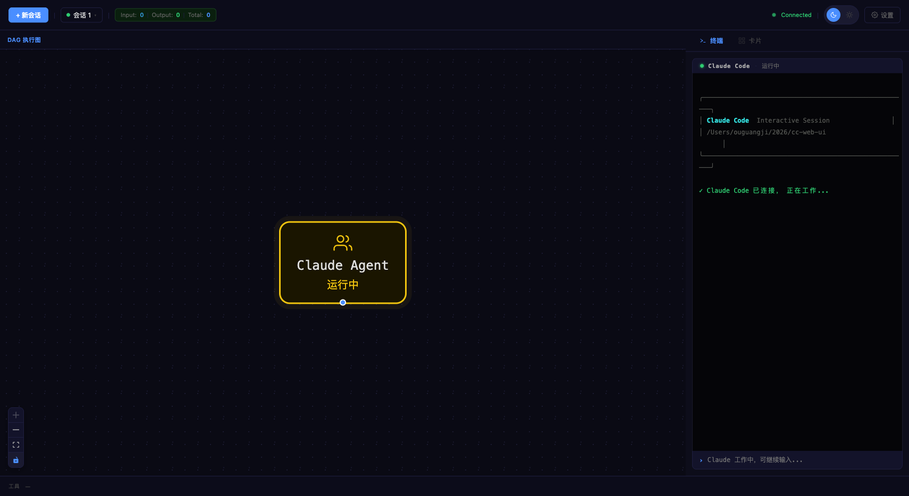
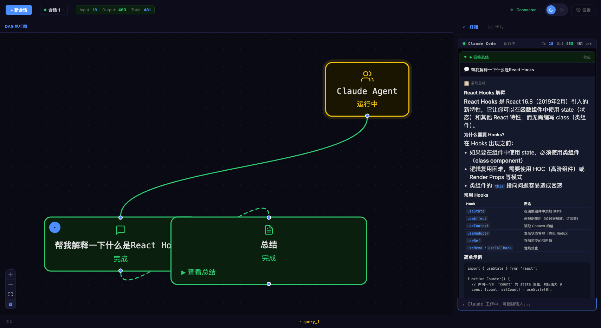
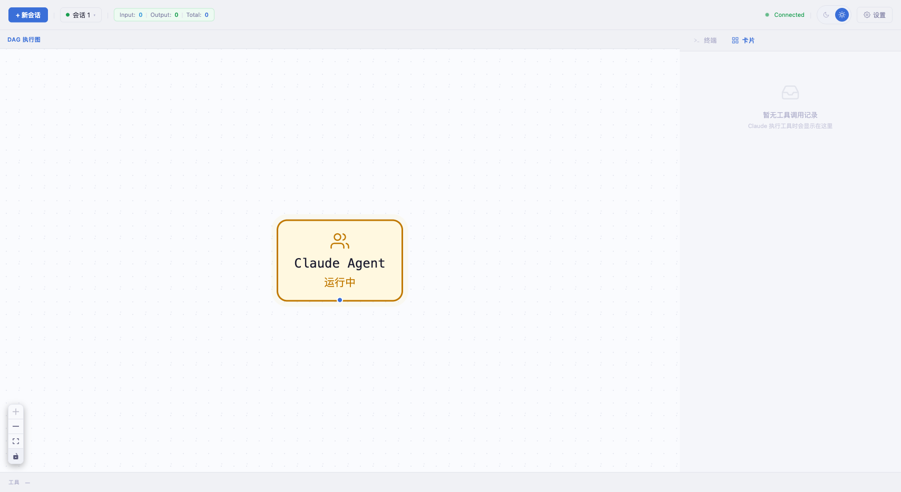
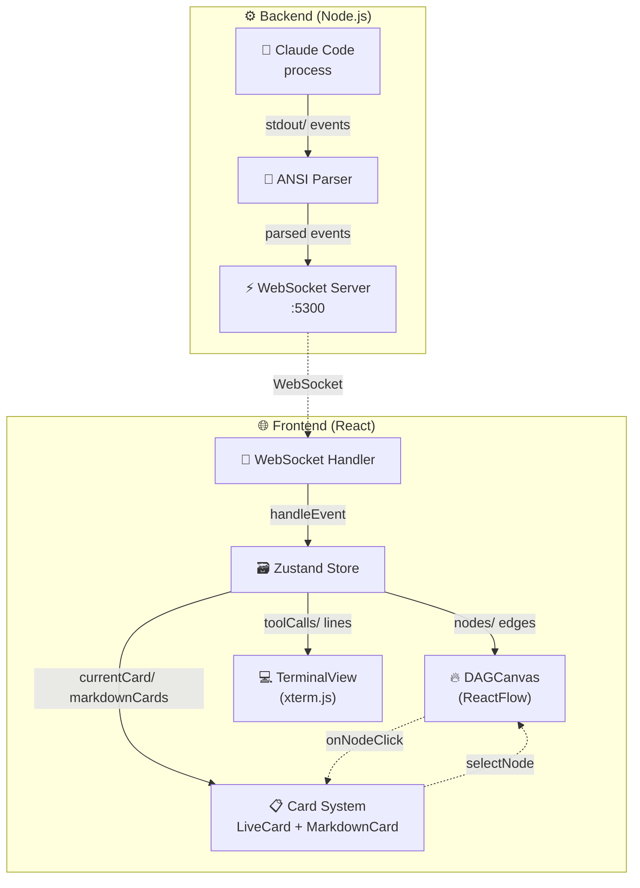
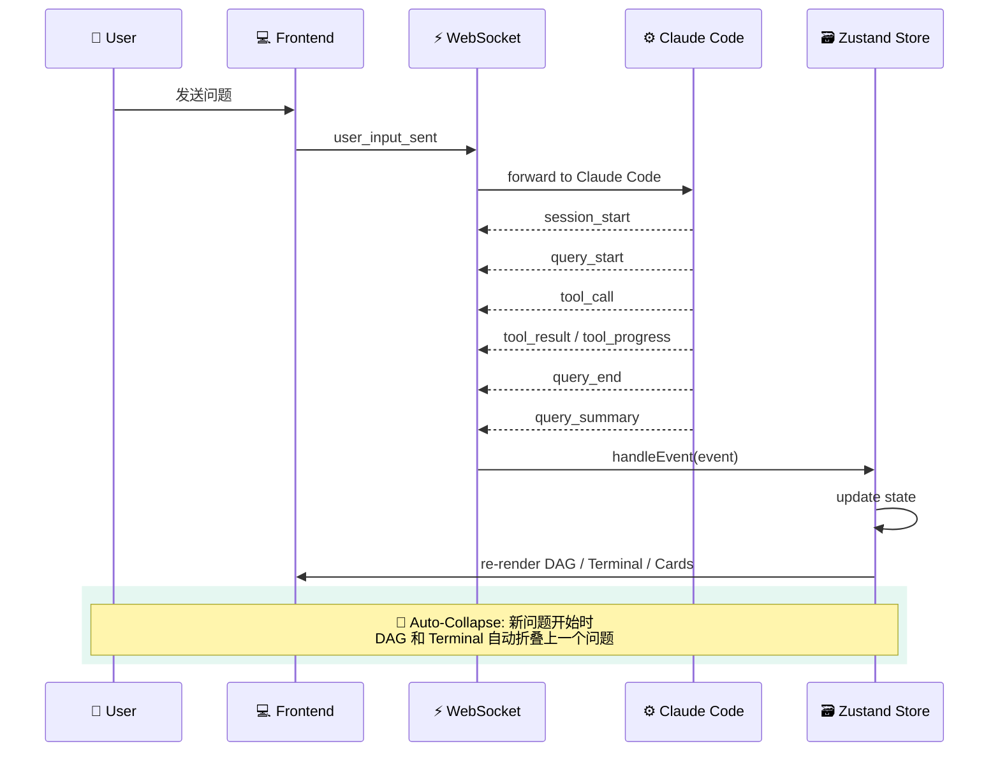
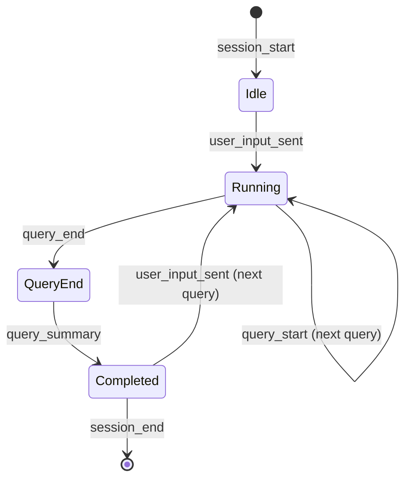
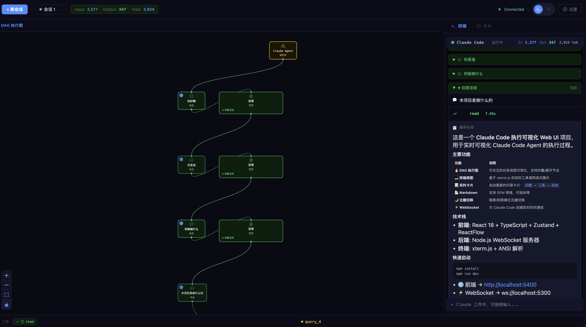
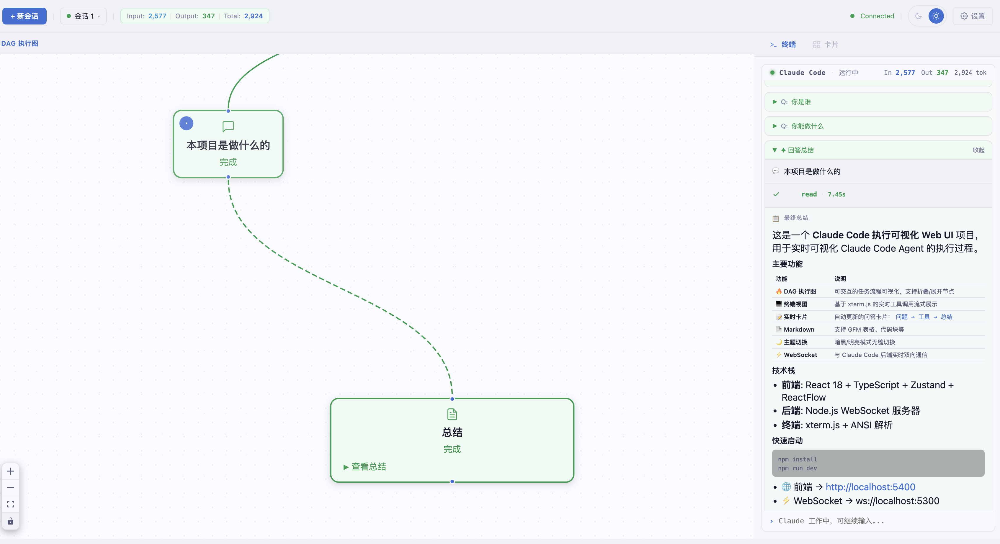
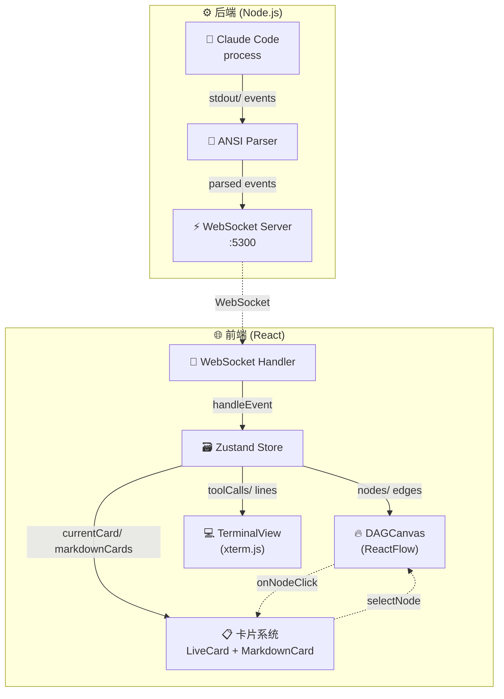
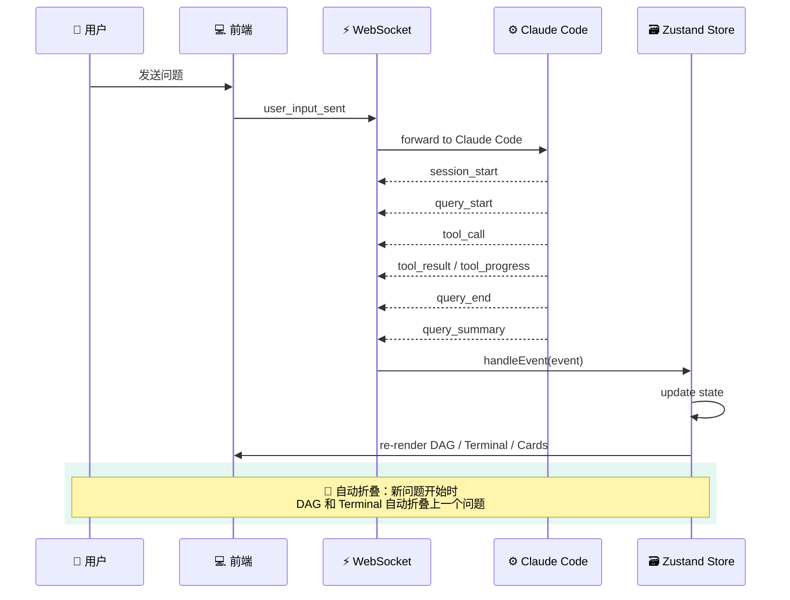

# Claude Code DAG Web UI

<p align="center">
  
</p>

<p align="center">
  <a href="https://github.com/ogj130/claude-code-dag-web-ui">
    
  </a>
  
  
  
  
  
</p>

[English](#english) · [中文](#中文)

---

## English

> ✨ A modern web interface for visualizing Claude Code agent execution in real-time

### Features

| | |
|---|---|
| 🔥 **DAG Execution Graph** | Interactive task flow visualization with collapsible query nodes |
| 💻 **Terminal Tool View** | Real-time tool call display via xterm.js, ToolCards embedded directly in terminal — no Tab switching |
| 📝 **Live Card System** | Auto-updating cards: `query → tools → summary`, arranged chronologically top-to-bottom |
| 📄 **Markdown Rendering** | Beautiful markdown with GFM support, tables, code blocks |
| 🌙 **Dark / Light Mode** | Seamless theme switching with CSS variables |
| 📁 **Session Management** | Multiple Claude Code sessions with history navigation |
| ⚡ **WebSocket** | Real-time bidirectional communication |
| ✨ **Streaming Summary** | AI response streamed in real-time + MarkdownCard typewriter animation + blinking green cursor |
| 📐 **Responsive Layout** | < 1024px fixed / 1024-1440px 50/50 split / > 1440px DAG-first 55/45 |

### Preview

<details open>
<summary><b>🗺️ DAG Execution Graph (Dark Mode)</b></summary>

</details>

<details>
<summary><b>📋 Terminal Card View (Dark Mode)</b></summary>

</details>

<details>
<summary><b>☀️ Light Mode Preview</b></summary>

</details>

### Quick Start

```bash
# Install
npm install

# Start (frontend + backend)
npm run dev
```

> 🌐 Frontend → http://localhost:5400
> ⚡ WebSocket → ws://localhost:5300

### Architecture

#### Event-Driven State

The UI is entirely driven by events from the Claude Code backend:

| Event | Description |
|---|---|
| `session_start` | Agent session initialized |
| `query_start` | New user query begins |
| `query_end` | Query execution completes |
| `summary_chunk` | AI response fragment (streaming) |
| `query_summary` | Final summary generated |
| `tool_call` | Tool invocation starts |
| `tool_result` | Tool execution result |
| `tool_progress` | Real-time progress updates |
| `token_usage` | Token consumption stats |

#### DAG Node Types

| Type | Description |
|---|---|
| 🟦 **Agent** | Root Claude Agent node |
| 🟩 **Query** | User question node (collapsible) |
| 🟨 **Tool** | Tool execution node |
| 🟪 **Summary** | Query completion summary |

#### Card System

| Card | Description |
|---|---|
| ⚡ **LiveCard** | Real-time in-progress card (streaming updates) |
| ✅ **MarkdownCard** | Completed Q&A card with collapsible analysis, **summary with typewriter animation** |

#### Terminal Layout (Top → Bottom)

```
MarkdownCard × N (completed)
  └ LiveCard (previousCard) + ToolCards (waiting for summary)
      └ LiveCard (currentCard) ← in-progress Q&A
          └ ToolCards (current round tools)
              └ Streaming Summary Preview (summaryChunks real-time)
                  └ xterm (raw terminal logs, no duplicate tool progress)
```

#### Streaming Summary Mechanism

```
summary_chunk event → summaryChunks[] accumulated → streaming preview renders
         │
         │ query_summary arrives
         ▼
MarkdownCard appears (content starts from streaming) → typewriter animation → cursor disappears
```

### Tech Stack

```
Frontend          Backend
─────────────     ─────────────
 React 18    →    Node.js WS
 TypeScript  →    tsx runner
 Zustand     →    ws server
 ReactFlow   →    Claude Code
 xterm.js    →    process
 react-md    →    ANSI parser
```

#### System Architecture



#### Event-Driven Data Flow



#### State Transition



---

## 中文

> ✨ 现代化 Claude Code 执行可视化 Web 界面

### 功能特性

| | |
|---|---|
| 🔥 **DAG 执行图** | 可交互的任务流程可视化，支持折叠/展开查询节点 |
| 💻 **终端工具视图** | 基于 xterm.js 的实时工具调用展示，工具卡片直接嵌入终端，无需 Tab 切换 |
| 📝 **实时卡片系统** | 自动更新的问答卡片：`问题 → 工具 → 总结`，按时间顺序从上往下排列 |
| 📄 **Markdown 渲染** | 支持 GFM 的精美渲染，含表格、代码块等 |
| 🌙 **暗黑/明亮模式** | 基于 CSS 变量的无缝主题切换 |
| 📁 **会话管理** | 多会话历史记录与导航 |
| ⚡ **WebSocket** | 与 Claude Code 后端的实时双向通信 |
| ✨ **流式总结** | AI 回答实时流式输出 + MarkdownCard 逐字补完动画 + 绿色闪烁光标 |
| 📐 **响应式布局** | < 1024px 固定宽度 / 1024-1440px 均分 50/50 / > 1440px DAG 优先 55/45 |

### 效果预览

<details open>
<summary><b>🗺️ DAG 执行图（暗黑模式）</b></summary>


</details>

<details>
<summary><b>📋 终端卡片视图（暗黑模式）</b></summary>

</details>

<details>
<summary><b>☀️ 明亮模式预览</b></summary>


</details>

### 快速开始

```bash
# 安装依赖
npm install

# 启动开发（前端 + 后端）
npm run dev
```

> 🌐 前端 → http://localhost:5400
> ⚡ WebSocket → ws://localhost:5300

### 架构设计

#### 事件驱动状态

UI 完全由 Claude Code 后端的事件驱动：

| 事件 | 说明 |
|---|---|
| `session_start` | Agent 会话初始化 |
| `query_start` | 新用户问题开始 |
| `query_end` | 问题执行完成 |
| `summary_chunk` | AI 回答片段（流式） |
| `query_summary` | 最终总结生成 |
| `tool_call` | 工具调用开始 |
| `tool_result` | 工具执行结果 |
| `tool_progress` | 实时进度更新 |
| `token_usage` | Token 消耗统计 |

#### DAG 节点类型

| 类型 | 说明 |
|---|---|
| 🟦 **Agent** | 根节点 — Claude Agent |
| 🟩 **Query** | 查询节点 — 用户问题（可折叠）|
| 🟨 **Tool** | 工具节点 — 工具执行 |
| 🟪 **Summary** | 总结节点 — 问题完成总结 |

#### 卡片系统

| 卡片 | 说明 |
|---|---|
| ⚡ **LiveCard** | 实时卡片 — 正在进行的问答（流式更新）|
| ✅ **MarkdownCard** | 完成卡片 — 已完成的问答，支持折叠分析内容，**总结区域带逐字补完动画** |

#### 终端视图布局（从上到下）

```
MarkdownCard × N（已完成）
  └ LiveCard（previousCard） + ToolCards（等待总结到来）
      └ LiveCard（currentCard）← 进行中的问答
          └ ToolCards（当前轮工具）
              └ 流式总结预览区（summaryChunks 实时渲染）
                  └ xterm（原始终端日志，无重复工具进度）
```

#### 流式总结机制

```
summary_chunk 事件 → summaryChunks[] 累积 → 流式预览区实时显示
         │
         │ query_summary 到达
         ▼
MarkdownCard 出现（内容从流式内容开始）→ 逐字补完动画 → 光标消失
```

### 技术栈

```
前端              后端
─────────────     ─────────────
 React 18    →    Node.js WS
 TypeScript  →    tsx runner
 Zustand     →    ws server
 ReactFlow   →    Claude Code
 xterm.js    →    ANSI parser
 react-md    →    process
```

#### 系统架构图



#### 事件驱动数据流



#### 状态转换图


---

## License

MIT · Made with 💙 by [ogj130](https://github.com/ogj130)
