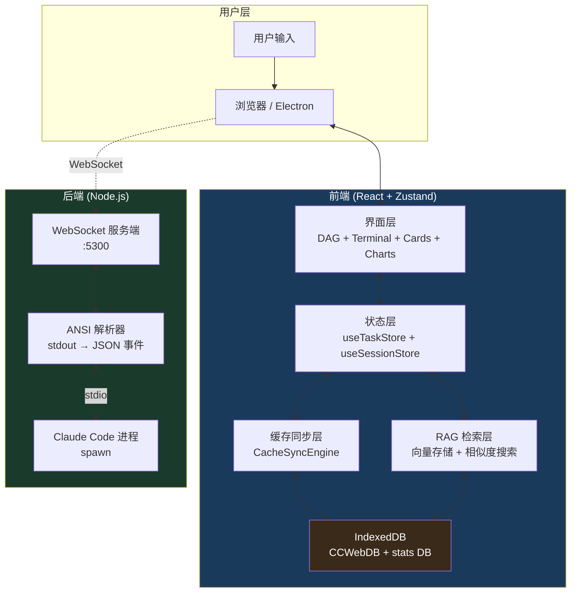
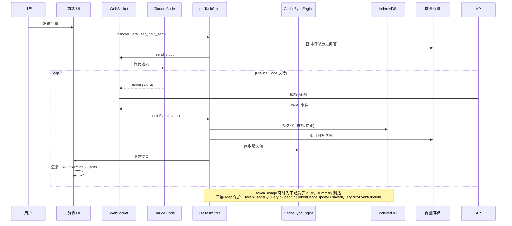
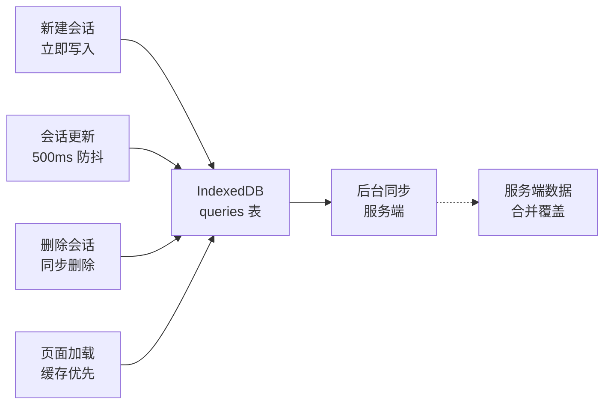
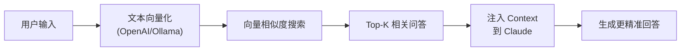
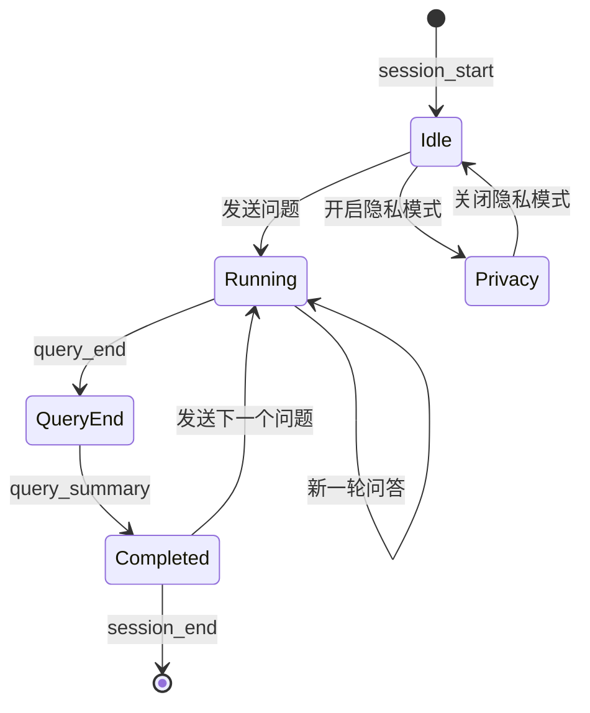

# Claude Code DAG Web UI

<p align="center">
  
</p>

<p align="center">

[](https://opensource.org/licenses/MIT)
[](https://www.typescriptlang.org/)
[](https://react.dev/)
[](https://www.electronjs.org/)
[](https://nodejs.org/)

</p>

---

## 这个项目做什么？

将 Claude Code 的 Agent 执行过程以 **DAG（有向无环图）** 的形式实时可视化，让你直观看到 AI 在思考什么、调用了什么工具、输出了什么结果——而不是面对一片滚动的终端日志。

---

## 适合哪些人？

| 群体 | 为什么需要它 |
|------|-------------|
| **Claude Code 重度用户** | 可视化理解 AI 的执行链路，不再靠猜 |
| **AI Agent 开发者** | 调试 Agent 行为，分析工具调用链路 |
| **学习 AI 编程的开发者** | 可视化理解 AI 如何分解任务、调用工具 |
| **数据分析师** | 分析 Token 消耗趋势，优化 Prompt 成本 |

---

## 效果预览

<details open>
<summary><strong>DAG 执行图（暗黑模式）</strong></summary>

</details>

<details>
<summary><strong>终端卡片视图（暗黑模式）</strong></summary>

</details>

<details>
<summary><strong>明亮模式</strong></summary>

</details>

---

## 环境要求

- **Node.js** ≥ 20（推荐 22）
- **Claude Code CLI** 已安装

```bash
npm install -g @anthropic/claude-code
claude --version  # 验证安装
```

---

## 使用方式一：开发模式

```bash
# 克隆项目
git clone https://github.com/ogj130/claude-code-dag-web-ui.git
cd claude-code-dag-web-ui

# 安装依赖
npm install

# 启动（前端 + 后端同时运行）
npm run dev
```

浏览器打开 **http://localhost:5400**

---

## 使用方式二：安装桌面应用

👉 **[下载最新版本](https://github.com/ogj130/claude-code-dag-web-ui/releases/latest)**

### macOS

1. 下载 `.dmg` 镜像（Apple Silicon 选 arm64，Intel 选 x64）
2. 打开 DMG，拖入「应用程序」
3. 首次运行需在「系统设置 → 隐私与安全性」允许

### Windows

下载 `.exe` 安装包，双击运行即可。

### Linux

```bash
# AppImage（推荐）
chmod +x Claude-Code-Web-UI-*.AppImage
./Claude-Code-Web-UI-*.AppImage

# 或 deb
sudo dpkg -i claude-code-web-ui_*.deb
```

---

## 功能特性

| | |
|---|---|
| **DAG 执行图** | 可视化 Agent 思维链路，节点可折叠/展开 |
| **终端 + 工具卡片** | 实时工具调用展示，无需 Tab 切换 |
| **流式总结** | AI 回答逐字输出，卡片带打字机动画 |
| **Markdown 渲染** | GFM 支持，含表格、代码块等 |
| **暗黑/明亮模式** | CSS 变量驱动，一键切换 |
| **多会话管理** | 多会话历史，随时切换，FIFO 自动淘汰（≥100 条） |
| **隐私模式** | 本地离线模式，不上传任何数据到服务端 |
| **Token 趋势统计** | 折线图展示输入/输出 Token 消耗趋势 |
| **执行分析面板** | 工具分布图、错误率趋势、耗时分析 |
| **RAG 智能检索** | 基于向量相似度的历史问答召回 |
| **向量化配置** | 支持 OpenAI / Ollama / Cohere 多后端 |
| **缓存持久化** | IndexedDB 本地缓存 + 防抖写入 + 服务端同步 |
| **响应式布局** | 自适应窗口宽度 |
| **快捷键支持** | Cmd+K 搜索、Cmd+\ 折叠等 |

---

## 界面说明

```
┌──────────────────────────────────────────────────────────────┐
│  Toolbar：会话列表 / 主题切换 / Token 统计 / RAG / 隐私设置    │
├──────────────────────────┬───────────────────────────────────┤
│                          │                                    │
│   DAG 可视化区域           │   终端视图区域                      │
│   实时展示 Agent 执行链路   │   原始工具日志 + 输入框              │
│   可折叠/展开查询节点       │                                    │
│                          │                                    │
├──────────────────────────┴───────────────────────────────────┤
│  Bottom Bar：最近工具调用 / Token 消耗 / RAG 上下文条数        │
└──────────────────────────────────────────────────────────────┘
```

### DAG 节点类型

| 节点 | 含义 | 颜色 |
|------|------|------|
| **Agent** | 根节点，Claude Agent 本身 | 蓝 |
| **Query** | 用户提问（可折叠） | 绿 |
| **Tool** | 工具调用（Read/Bash/Edit 等） | 黄 |
| **RAG** | 向量检索结果（可折叠） | 橙 |
| **Summary** | 本轮总结，AI 生成的分析 | 紫 |

---

## 架构设计

### 系统架构（完整分层）



### 事件驱动数据流



### 缓存同步策略（Phase 2.2）



### RAG 检索流程



### 状态转换



### 模块说明

| 模块 | 职责 |
|------|------|
| `src/stores/useTaskStore.ts` | 核心状态管理，事件处理器，DAG 节点状态 |
| `src/stores/useSessionStore.ts` | 会话管理，FIFO 淘汰，隐私模式，缓存同步 |
| `src/stores/cacheSync.ts` | 缓存同步引擎，防抖/立即写入，服务端同步 |
| `src/stores/queryStorage.ts` | Query CRUD，自动压缩，分片存储 |
| `src/stores/db.ts` | stats DB (Dexie)，Token/执行统计持久化 |
| `src/lib/db.ts` | CCWebDB (Dexie)，RAG 内容存储，向量索引 |
| `src/stores/vectorStorage.ts` | 向量存储，向量化配置，Ollama/OpenAI/Cohere |
| `src/components/DAG/` | ReactFlow 可视化，节点渲染，布局算法 |
| `src/components/ToolView/` | 终端视图、工具卡片、Markdown 渲染 |
| `src/components/TokenAnalytics.tsx` | Token 趋势折线图、模型定价表 |
| `src/components/ExecutionAnalytics.tsx` | 工具分布、错误率趋势、耗时分析 |
| `src/components/RAGRetrievalPanel.tsx` | RAG 检索面板，向量配置，索引管理 |
| `src/hooks/useWebSocket.ts` | WebSocket 连接，事件分发 |
| `server/` | WebSocket Server + ANSI Parser + Claude Code 进程管理 |
| `electron/` | Electron 主进程，HTTP 静态服务器，桌面打包 |

### 数据库架构

```
┌─────────────────────────────────────────────────────┐
│                 IndexedDB (Dexie.js)                │
├──────────────────┬─────────────────────────────────┤
│   CCWebDB        │   cc-web-ui (stats DB)           │
│   ───────────    │   ─────────────────────          │
│  sessions        │  sessions (元数据)                │
│  queries (RAG)   │  queries (统计)                   │
│                  │  toolCalls                        │
│  用于 RAG 检索    │  sessionShards (分片)             │
│                  │                                  │
│  向量化索引       │  用于 Token/执行分析               │
│  分片存储         │  workspacePath 过滤              │
└──────────────────┴─────────────────────────────────┘
```

---

## 数据安全

| 模式 | 数据存储 | 网络同步 |
|------|----------|----------|
| **标准模式** | IndexedDB 本地 + 可选服务端同步 | WebSocket |
| **隐私模式** | 仅 localStorage | 无任何网络请求 |
| **RAG 索引** | API Key 加密存储 (AES-GCM) | 仅发送给配置的 Embedding 后端 |

---

## 技术栈

```
前端                  后端                   Electron
───────────────     ────────────────       ─────────────
 React 18      →    Node.js WS Server      Electron 33
 TypeScript    →    tsx runner             WebSocket
 Zustand       →    Claude Code spawn     HTTP Server
 ReactFlow     →    ANSI Parser           electron-builder
 xterm.js      →                         (跨平台打包)
 react-markdown→
 Dexie.js      →
```

---

## 本地构建

```bash
# 克隆后
npm install

# 前端构建
npm run build

# Electron 桌面应用构建
cd electron
npm install
ELECTRON_MIRROR="https://npmmirror.com/mirrors/electron/" npm run dist

# 输出目录
electron/release/
├── *.dmg      # macOS
├── *.exe      # Windows
├── *.AppImage # Linux
├── *.deb
└── *.rpm
```

---

## License

MIT · Made with by [ogj130](https://github.com/ogj130)
