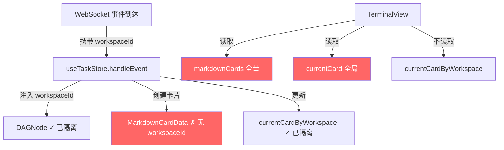

# Bug 修复报告: 工作区隔离失效

**日期**: 2026-04-29
**严重度**: High
**影响范围**: 终端视图的问答卡片、进行中卡片在多工作区 global dispatch 时混叠

---

## 症状

切换到不同工作区标签后，终端界面（TerminalView）仍然显示其他工作区的历史问答卡片和进行中的 LiveCard，没有正确隔离。

## 根因



三个断裂点:

1. **`MarkdownCardData` 接口缺少 `workspaceId` 字段** — 卡片创建时未注入工作区标识 (`src/stores/useTaskStore.ts:13-24`)
2. **`TerminalView` 未过滤 `markdownCards`** — 直接渲染全量卡片，不做工作区筛选 (`src/components/ToolView/TerminalView.tsx:125`)
3. **`TerminalView` 使用全局 `currentCard` 而非 `currentCardByWorkspace[wid]`** — store 已有隔离机制但终端未使用 (`src/components/ToolView/TerminalView.tsx:128`)

对比如下:

| 组件 | 数据 | 是否隔离 |
|------|------|----------|
| DAGCanvas | `nodes` | ✅ `node.workspaceId === activeTab` |
| TerminalView | `markdownCards` | ❌ 无 workspaceId，全量渲染 |
| TerminalView | `currentCard` | ❌ 使用全局 currentCard |
| useTaskStore | `currentCardByWorkspace` | ✅ 已实现但未被消费 |

## 修复

### 1. `useTaskStore.ts` — 数据层补全

```typescript
// MarkdownCardData 新增字段
export interface MarkdownCardData {
  // ... 原有字段
  workspaceId?: string;  // V3.0.0: 工作区隔离
}
```

两处 `summary` 事件处理器中，卡片创建时注入 `workspaceId: wid`:

```typescript
// Line ~820 (情况1: 当前进行中卡片)
{
  // ... 其他字段
  workspaceId: wid,  // ← 新增
}

// Line ~865 (情况2: 前一张被折叠卡片)
{
  // ... 其他字段
  workspaceId: wid,  // ← 新增
}
```

### 2. `TerminalView.tsx` — 视图层过滤

```typescript
// 读取 store 时区分全局/工作区数据
const {
  markdownCards: allMarkdownCards,    // 重命名为全量
  currentCard: globalCurrentCard,     // 重命名为全局
  previousCard: globalPreviousCard,
  currentCardByWorkspace,             // 新增读取
  previousCardByWorkspace,            // 新增读取
} = useTaskStore();

// V3.0.0: 工作区隔离逻辑
const isWorkspaceView = activeTab !== 'global' && workspaceTabs.length > 0;

// 按 workspaceId 过滤卡片
const markdownCards = isWorkspaceView
  ? allMarkdownCards.filter(c => !c.workspaceId || c.workspaceId === activeTab)
  : allMarkdownCards;

// 使用 workspace-specific 进行中卡片
const currentCard = isWorkspaceView
  ? (currentCardByWorkspace[activeTab] ?? null)
  : globalCurrentCard;

const previousCard = isWorkspaceView
  ? (previousCardByWorkspace[activeTab] ?? null)
  : globalPreviousCard;
```

过滤逻辑说明:
- `!c.workspaceId` → 无 workspaceId 的旧卡片（升级前创建）在非全局视图中也显示，避免丢失数据
- `c.workspaceId === activeTab` → 精确匹配当前工作区

### 二次修复 (c11f823)

第一次修复中过滤条件 `!c.workspaceId ||` 过于宽松: 旧卡片（修复前创建，无 `workspaceId`）的 `!c.workspaceId` 为 `true`，导致它们在所有工作区视图中可见。

**修正**: 移除 `!c.workspaceId ||`，仅保留精确匹配:
```typescript
// Before (broken): 旧卡片绕过过滤
allMarkdownCards.filter(c => !c.workspaceId || c.workspaceId === activeTab)

// After (fixed): 精确匹配，全局视图显示全部
allMarkdownCards.filter(c => c.workspaceId === activeTab)
```

**行为矩阵**:

| 视图 | 旧卡片(无 workspaceId) | ws-A 卡片 | ws-B 卡片 |
|------|------------------------|-----------|-----------|
| 全局 | ✅ 显示 | ✅ 显示 | ✅ 显示 |
| 工作区A | ❌ 隐藏 | ✅ 显示 | ❌ 隐藏 |
| 工作区B | ❌ 隐藏 | ❌ 隐藏 | ✅ 显示 |

## 验证

- TypeScript 编译: 零错误
- 测试: 51/51 通过 (含新增 `workspaceMarkdownFilter.test.ts` 5 个测试)
- 测试覆盖场景:
  - 全局视图显示全部卡片（包括无 workspaceId 的旧卡片）
  - 切换工作区后仅显示匹配卡片
  - 无卡片的工作区显示空列表
  - 无 workspaceTabs 时回退全局视图

## 经验教训

### 模式: 多工作区数据隔离

当系统支持多个工作区并行执行时，所有 UI 数据层都需要工作区感知:

```
数据隔离检查清单:
□ DAG 节点: workspaceId 字段 + 渲染层过滤
□ 问答卡片 (MarkdownCardData): workspaceId 字段 + 渲染层过滤
□ 进行中卡片 (CurrentCardData): 按 workspaceId 分 Map 存储
□ 工具调用 (ToolCall): 如直接列表展示，也需过滤
□ 终端输出行: 如拆分展示，需关联 workspaceId
```

### 数据层 vs 视图层职责

- **数据层** (`useTaskStore`): 负责为每条数据标记 `workspaceId`（在事件处理时注入）
- **视图层** (`TerminalView`): 负责按当前 `activeTab` 过滤数据
- **原则**: 数据创建时打标，渲染时过滤。不要在渲染层推导 workspaceId

### 排查技巧

对比 `DAGCanvas`（已验证隔离）和 `TerminalView`（未隔离）的数据读取方式，快速定位差异: `DAGCanvas` 有 `nd.workspaceId === activeTab` 过滤，`TerminalView` 没有。

## 关联文件

| 文件 | 角色 |
|------|------|
| `src/stores/useTaskStore.ts` | 数据中心: MarkdownCardData 定义 + 卡片创建 |
| `src/components/ToolView/TerminalView.tsx` | 视图: 工作区过滤逻辑 |
| `src/stores/useTerminalWorkspaceStore.ts` | 工作区状态: activeTab 管理 |
| `src/components/DAG/DAGCanvas.tsx` | 参考实现: 已有的工作区节点过滤 |
| `src/stores/memory/dispatch_store_sync_bug.md` | 历史经验: 多工作区 Dispatch Store 同步 Bug |

## 提交

- `0f0d246` fix: workspace isolation — filter markdownCards and currentCard by activeTab in TerminalView
- `c11f823` fix: remove permissive !c.workspaceId filter — old cards without workspaceId now hidden in workspace-specific views
